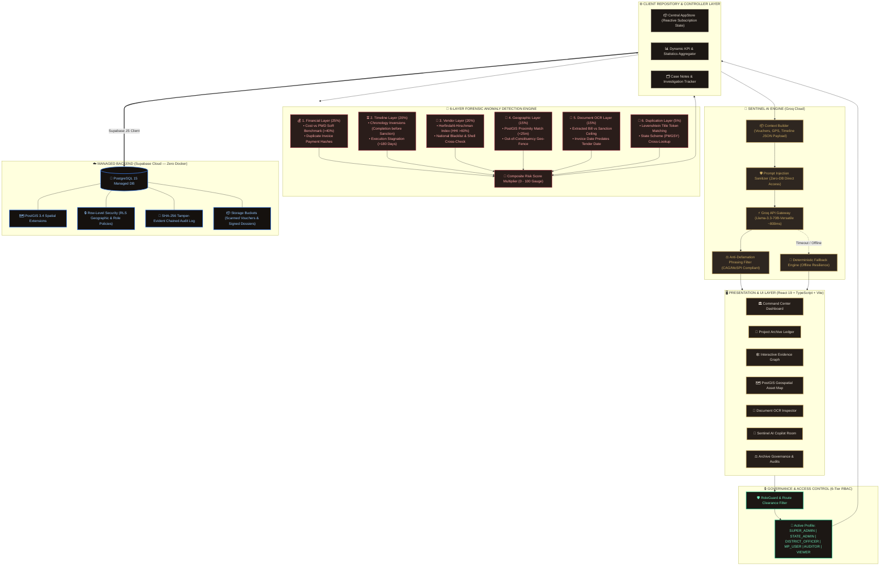

# 🏛️ MPLAD SENTINEL — SYSTEM ARCHITECTURE SPECIFICATION

> **Explainable Multi-Layer Forensic Risk Intelligence & Governance Platform**  
> *Smart India Hackathon (SIH 2026)*

---

## 1. Complete System Architecture Diagram

---

## 2. Layer-by-Layer Architectural Breakdown

### 🖥️ Layer 1: Presentation & Design System
* **Framework**: React 19, TypeScript, Vite, Tailwind CSS v4.
* **Aesthetics**: "Government Investigation Notebook" with rich dark mode, warm paper tones, brass glowing accents, and tactile physical dossier cards.
* **Visualizations**: 
  - Leaflet / OpenStreetMap for PostGIS spatial clustering.
  - Interactive SVG Relational Evidence Graph.
  - Recharts for financial and risk distribution analytics.

---

### 🔒 Layer 2: 6-Tier Role-Based Access Control (RBAC)
* **Clearance Levels**:
  - `SUPER_ADMIN` (MoSPI National Admin): Full supervisory access, risk weight calibration.
  - `STATE_ADMIN` (State Nodal Dept): State-wide analytics, project ledger.
  - `DISTRICT_OFFICER` (District Magistrate): Local site verification, voucher approval, field notes.
  - `MP_USER` (Member of Parliament): Constituency progress, AI synthesis queries.
  - `AUDITOR` (CAG of India): Independent forensic audits, dossier sign-offs.
  - `VIEWER` (Citizen): Public transparency portal (read-only).
* **Enforcement**: Frontend `RoleGuard` + Dynamic Navigation Filtering + Database PostgreSQL Row-Level Security (RLS).

---

### 🔬 Layer 3: 6-Layer Forensic Anomaly Engine
* **Deterministic Precision**: Operates on verified administrative data with explicit rule IDs (e.g., `FIN-COST-001`, `TIME-SEQ-001`, `GEO-DUP-001`).
* **Weighted Aggregator**:
  $$\text{Composite Risk} = 0.25(\text{Fin}) + 0.20(\text{Time}) + 0.20(\text{Ven}) + 0.15(\text{Geo}) + 0.15(\text{Doc}) + 0.05(\text{Dup})$$

---

### 🤖 Layer 4: Grounded Sentinel AI Copilot (Groq Llama-3.3 70B)
* **Zero-Hallucination Grounding**: Operates strictly on structured `GroundingContext` JSON payloads containing only documented facts.
* **Security Guardrails**:
  - `sanitizeUntrustedText`: Neutralizes prompt injection attempts from OCR inputs.
  - `enforceSafetyLanguage`: Transforms raw accusations into objective, legally defensible audit observations (*"Evidence conflict observed"* rather than defamatory claims).

---

### ☁️ Layer 5: Cloud Backend & Storage (Supabase Cloud)
* **PostgreSQL + PostGIS**: High-speed spatial queries (`ST_DWithin`) to detect physical asset overlaps within 25 meters.
* **Immutable Audit Trail**: Append-only PostgreSQL triggers enforcing SHA-256 cryptographic hash-chaining on every record change.
* **Serverless Scale**: Zero local Docker daemons required; connects instantly via HTTPS/WSS endpoints.
