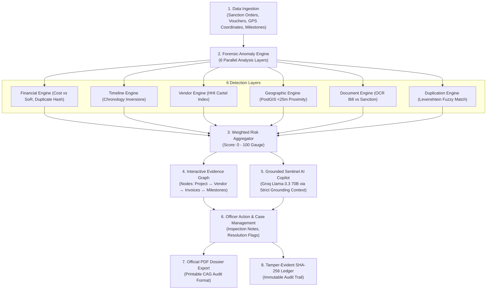

<div align="center">

# 🛡️ MPLAD SENTINEL
### *Explainable Multi-Layer Forensic Risk Intelligence & Governance Platform*

**Smart India Hackathon (SIH 2026)** • **Ministry of Statistics & Programme Implementation (MoSPI)**

---

[](https://github.com/Harshal844600/MAPLAD-SIH-2026)
[](https://react.dev/)
[](https://groq.com/)
[](https://supabase.com/)
[](https://github.com/Harshal844600/MAPLAD-SIH-2026)
[](LICENSE)

<br/>


</div>

---

## 📑 Table of Contents
- [Executive Overview](#-executive-overview)
- [Problem Statement vs. Our Solution](#-problem-statement-vs-our-solution)
- [System Architecture & Data Pipeline](#-system-architecture--data-pipeline)
  - [Full Architecture Block Diagram](#-full-system-architecture-diagram)
  - [Monochrome / Print Edition Diagram](#-monochrome--print-edition-diagram)
  - [End-to-End Execution Flow](#-end-to-end-execution-flow)
- [6-Layer Forensic Anomaly Engine](#-6-layer-forensic-anomaly-engine)
- [6-Tier Role-Based Access Control (RBAC)](#-6-tier-role-based-access-control-rbac)
- [Grounded Sentinel AI Copilot (Groq Llama-3.3 70B)](#-grounded-sentinel-ai-copilot-groq-llama-33-70b)
- [Flagship Demo Scenario (#MPLAD-10291)](#-flagship-demo-scenario-mplad-10291)
- [Project Directory Structure](#-project-directory-structure)
- [Quickstart & Local Installation](#-quickstart--local-installation)
- [Supabase Cloud Deployment (Zero Docker)](#-supabase-cloud-deployment-zero-docker)
- [Ethical AI & Legal Disclaimer](#-ethical-ai--legal-disclaimer)

---

## 📖 Executive Overview

The **Members of Parliament Local Area Development Scheme (MPLADS)** allocates ₹5 Crore annually to each MP for local development works. However, central and state auditors face major challenges:
1. **Ghost Assets & Duplicate Billing**: Repeated payouts for identical assets funded across different schemes.
2. **Cost Escalation**: Rates inflated significantly above state **Schedule of Rates (SoR)** standards.
3. **Paperwork Chronology Inversions**: Milestone certificates signed before official sanctions are granted.
4. **Contractor Cartelization**: A handful of vendors capturing majority constituency projects.

**MPLAD Sentinel** solves this by fusing **deterministic forensic rule calculations**, **PostGIS spatial proximity detection (<25m)**, **OCR document validation**, and **Grounded Groq AI Copilots (Llama-3.3 70B)** into a unified **"Government Investigation Notebook"** digital command center.

---

## ⚖️ Problem Statement vs. Our Solution

| Traditional MPLAD Monitoring | 🛡️ MPLAD Sentinel Solution |
| :--- | :--- |
| **Post-Facto Audits**: Irregularities detected 2–3 years after funds are fully spent. | **Real-Time Pre-Disbursement Shield**: Flagged dynamically before final payment clearance. |
| **Black-Box AI Skepticism**: Opaque scores rejected by District Collectors and CAG. | **100% Explainable "Why Flagged?"**: Explicit rule citations (`FIN-COST-001`, `GEO-DUP-001`). |
| **Scattered Paper Vouchers**: Invoices and measurement books isolated in district offices. | **Centralized OCR Document Archive**: Instant cross-matching against budget ceilings. |
| **Untracked Ghost Assets**: Physical duplicate works built within meters of existing halls. | **PostGIS Spatial Engine**: Automatic alerts on coordinates within **<25 meters** of completed works. |
| **Vulnerable Audit Records**: Manual logs susceptible to alteration or missing papers. | **Immutable Cryptographic Ledger**: Tamper-evident **SHA-256 chained audit logs**. |

---

## 🏛️ System Architecture & Data Pipeline

### 🎨 Full System Architecture Diagram
<div align="center">
  
</div>

### 📄 Monochrome / Print Edition Diagram
<div align="center">
  
</div>

### 🔄 End-to-End Execution Flow



---

## 🔬 6-Layer Forensic Anomaly Engine

Every registered public work is continuously evaluated in real time:

```
                  ┌─────────────────────────────────────────────────────────────┐
                  │                COMPOSITE RISK MULTIPLIER                    │
                  ├───────────┬───────────┬───────────┬───────────┬─────────────┤
                  │ Financial │ Timeline  │  Vendor   │Geographic │Document OCR │
                  │    25%    │    20%    │    20%    │    15%    │     15%     │
                  └───────────┴───────────┴───────────┴───────────┴─────────────┘
                                  (Duplication Layer: 5%)
```

| Layer | Weight | Core Detection Rules & Algorithmic Logic | Target Forensic Anomaly |
| :--- | :---: | :--- | :--- |
| 💰 **Financial** | **25%** | • **`FIN-COST-001`**: Project cost >40% above state PWD Schedule of Rates (SoR).<br>• **`FIN-DUP-002`**: Duplicate payment voucher hash matching prior disbursement.<br>• **`FIN-UTIL-003`**: 100% fund drawdown on physically stalled works. | Unit cost inflation & double-billing |
| ⏳ **Timeline** | **20%** | • **`TIME-SEQ-001`**: Completion certificate signed before sanction date.<br>• **`TIME-DELAY-002`**: Severe execution stagnation (>180 days without progress). | Backdated documentation & stalled works |
| 🏢 **Vendor** | **20%** | • **`VEN-CONC-001`**: Herfindahl-Hirschman Index (HHI >60%) showing market monopoly.<br>• **`VEN-SHELL-002`**: Matching against National Blacklist / Suspended Contractor Registry. | Contractor cartelization & shell entities |
| 📍 **Geographic** | **15%** | • **`GEO-DUP-001`**: PostGIS spatial proximity (`ST_DWithin`) within <25m of existing asset.<br>• **`GEO-OUT-002`**: GPS coordinates located outside parliamentary constituency boundary. | Ghost assets & boundary violations |
| 📄 **Document OCR**| **15%** | • **`DOC-MIS-001`**: Total extracted OCR invoice sum exceeds sanctioned ceiling.<br>• **`DOC-DATE-002`**: Contractor invoice date predates tender issuance date. | Forged bills & fiscal ceiling breaches |
| 🔁 **Duplication** | **5%** | • **`DUP-SIM-001`**: Levenshtein token semantic overlap matching state schemes (PMGSY). | Double-budgeting across schemes |

$$\text{Composite Risk} = 0.25(\text{Fin}) + 0.20(\text{Time}) + 0.20(\text{Ven}) + 0.15(\text{Geo}) + 0.15(\text{Doc}) + 0.05(\text{Dup})$$

* 🟢 **0 – 35**: **Low Risk** (Normal execution)
* 🟡 **36 – 69**: **Elevated Risk** (Document verification required)
* 🔴 **70 – 100**: **Critical Risk** (Immediate physical inspection freeze)

---

## 🔒 6-Tier Role-Based Access Control (RBAC)

MPLAD Sentinel enforces strict constitutional separation of administrative powers with frontend route guards and backend PostgreSQL Row-Level Security (RLS):

```
                                    ┌───────────────────────┐
                                    │ SUPER_ADMIN (National)│ ➔ Full Supervisory & Weights Calibration
                                    └───────────┬───────────┘
                                                │
                 ┌──────────────────────────────┼──────────────────────────────┐
                 ▼                              ▼                              ▼
      ┌─────────────────────┐        ┌─────────────────────┐        ┌─────────────────────┐
      │ AUDITOR (CAG Team)  │        │STATE_ADMIN (State)  │        │DISTRICT_OFFICER (DM)│
      │ • Forensic Inquiries│        │ • State Analytics   │        │ • Site Verifications│
      │ • Dossier Sign-offs │        │ • District Assign   │        │ • Voucher Approvals │
      └─────────────────────┘        └─────────────────────┘        └─────────────────────┘
                 │                                                             │
                 └──────────────────────────────┬──────────────────────────────┘
                                                ▼
                                     ┌─────────────────────┐
                                     │  MP_USER (MP Office)│ ➔ Constituency Recommendation Progress
                                     └──────────┬──────────┘
                                                ▼
                                     ┌─────────────────────┐
                                     │   VIEWER (Public)   │ ➔ Read-Only Transparency Ledger
                                     └─────────────────────┘
```

---

## 🤖 Grounded Sentinel AI Copilot (Groq Llama-3.3 70B)

The AI assistant acts as an automated forensic co-investigator:

1. **Strict Context Grounding (Zero Hallucination)**:
   The LLM operates on a verified `GroundingContext` JSON payload containing only documented vouchers, GPS coordinates, dates, and calculated rule violations.
2. **Prompt Injection Defense**:
   Untrusted input from OCR documents or user notes is passed through `sanitizeUntrustedText()`.
3. **Legal Anti-Defamation Phrasing**:
   All generated text is filtered through `enforceSafetyLanguage()`, translating defamatory accusations into objective, legally defensible audit terminology (*"Evidence conflict observed"* rather than defamatory statements).
4. **Deterministic Fallback**:
   If internet connectivity is interrupted or API keys are missing, the system automatically falls back to an in-memory deterministic reasoning engine with zero crashes.

---

## 🚀 Flagship Demo Scenario (`#MPLAD-10291`)

```text
Project: Construction of High-Tech Community Center & Digital Literacy Hall
Location: Phulpur, Prayagraj, Uttar Pradesh
Risk Score: 91/100 (CRITICAL)
```

1. **Navigate to Command Center** (`#/dashboard`): Inspect the Critical Priority Queue.
2. **Open Project `#MPLAD-10291`**: Click **"WHY FLAGGED?"** to view the 5 detected conflicts:
   - **Cost Inflation**: 120% unit cost inflation vs UP PWD Schedule of Rates benchmark.
   - **Duplicate Payment**: Duplicate payment of ₹18.20 Lakh on Invoice `#INV-APX-884`.
   - **GPS Overlap**: Asset coordinates are 8 meters from a completed 2023 Panchayat Hall.
   - **Timeline Inversion**: Completion certificate signed on 28-Feb-2024 prior to sanction date (15-Mar-2024).
3. **Inspect Interactive Evidence Graph**: Explore relational nodes linking contractors, bank transactions, and milestones.
4. **Query Sentinel AI Copilot**: Ask natural-language questions regarding evidence conflicts.
5. **Log Case Notes & Export Dossier**: Enter confidential officer notes and generate a printable formal CAG Audit Dossier.

---

## 📁 Project Directory Structure

```text
sih-2026/
├── public/
│   ├── architecture_diagram.jpg       # Full color system architecture diagram
│   ├── architecture_diagram_bw.jpg    # Monochrome schematic architecture diagram
│   └── favicon.svg
├── src/
│   ├── app/                           # Router and global context providers
│   ├── components/
│   │   ├── layout/                    # AppHeader, AppSidebar, RoleGuard
│   │   └── ui/                        # Classical & Hand-drawn Design System components
│   ├── design-system/                 # Colors, typography, borders, and token primitives
│   ├── pages/                         # Dashboard, Projects, Risk, Map, Investigations, Sentinel AI, OCR, Admin
│   ├── services/
│   │   ├── ai/                        # Groq client, GroundingContext builder, Safety filters
│   │   ├── demo/                      # High-fidelity synthetic MPLAD dataset
│   │   ├── detection/                 # 6 Forensic Detection Layer algorithms
│   │   ├── risk/                      # Risk weight calculator and score normalizer
│   │   ├── store/                     # App repository, reactive subscriptions, RBAC matrix
│   │   └── supabase/                  # Supabase Cloud client and live health checker
│   ├── test/                          # Vitest unit test suite (AI Safety, Rules, Risk)
│   └── types/                         # TypeScript interfaces and entity types
├── supabase/
│   ├── full_schema_and_seed.sql       # Turnkey PostgreSQL + PostGIS setup script
│   └── migrations/                    # Modular database migrations
├── ARCHITECTURE.md                    # Detailed architecture specifications
├── DATABASE.md                        # Database schema & PostGIS queries
├── SECURITY.md                        # RBAC & cryptographic audit logging documentation
├── SUPABASE_CLOUD_SETUP.md            # 3-step zero-docker deployment guide
└── package.json
```

---

## ⚡ Quickstart & Local Installation

### Prerequisites
- Node.js `v18+` or `v22+`
- npm `v9+` or `v10+`

### 1. Clone & Install Dependencies
```bash
git clone https://github.com/Harshal844600/MAPLAD-SIH-2026.git
cd MAPLAD-SIH-2026
npm install
```

### 2. Configure Environment Variables
Create a `.env` file in the root directory:
```env
VITE_SUPABASE_URL=https://your-project.supabase.co
VITE_SUPABASE_ANON_KEY=your-anon-key
VITE_GROQ_API_KEY=gsk_your_groq_api_key_here
VITE_GROQ_MODEL=llama-3.3-70b-versatile
```
*(Note: If no API key is provided, the platform automatically engages its high-fidelity deterministic grounding engine with 100% reliability).*

### 3. Run Development Server
```bash
npm run dev
```
Open **[http://localhost:3000](http://localhost:3000)** in your browser.

### 4. Run Automated Test Suite
```bash
npx vitest run
```

### 5. Build for Production
```bash
npm run build
```

---

## ☁️ Supabase Cloud Deployment (Zero Docker)

To run a live cloud backend without Docker:
1. Create a free project at **[supabase.com](https://supabase.com)** (Region: Mumbai / `ap-south-1`).
2. Go to the **SQL Editor** tab in your Supabase dashboard.
3. Open [`supabase/full_schema_and_seed.sql`](supabase/full_schema_and_seed.sql), copy its contents, paste them into the SQL editor, and click **Run**.
4. Copy your **Project URL** and **Anon Key** into your `.env` file.
5. Visit `http://localhost:3000/#/admin` → **"SYSTEM HEALTH & SERVICES"** to verify live connection latency!

---

## ⚖️ Ethical AI & Legal Disclaimer

*MPLAD Sentinel provides algorithmic risk indicators, evidence conflicts, and investigation recommendations for authorized government officers. It does not make definitive legal declarations of corruption or fraud. Final determinations remain under the statutory jurisdiction of authorized human investigators and constitutional audit authorities (CAG / MoSPI).*

---

<div align="center">

**© 2026 Ministry of Statistics & Programme Implementation (MoSPI) • Smart India Hackathon (SIH 2026)**  
*Developed with ❤️ for National Public Transparency and Good Governance*

</div>
