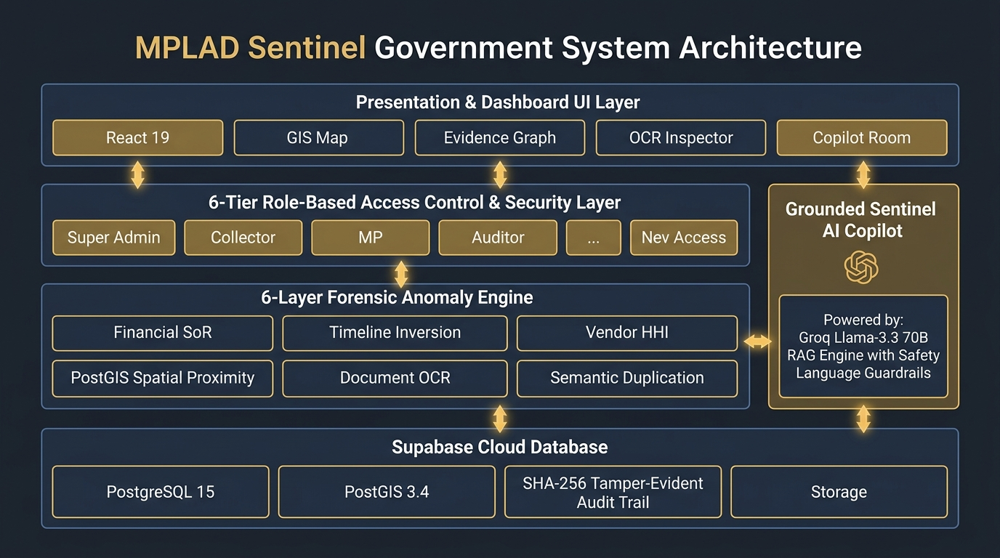
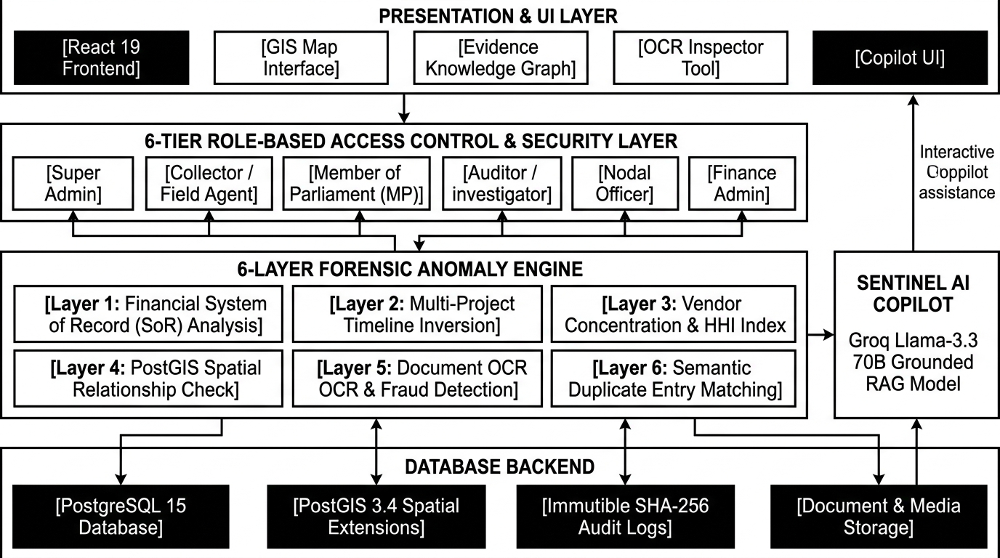
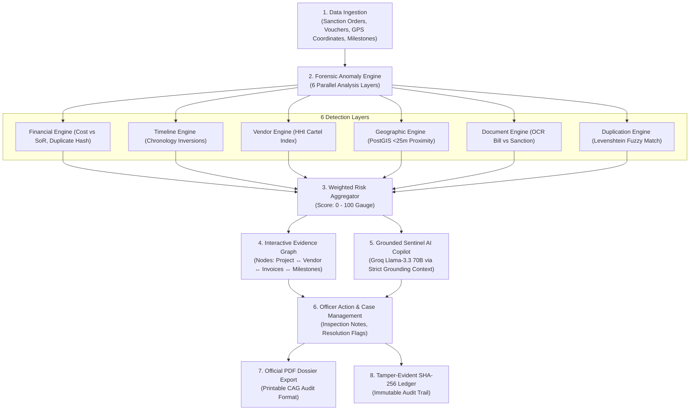

# 🛡️ MPLAD SENTINEL — AI-Powered Forensic Risk Intelligence Platform

<p align="center">
  
</p>

<p align="center">
  <strong>Development of an AI-Powered System to Detect Anomalies, Fraud, and Inefficiencies in MPLAD Scheme Implementation</strong><br>
  <em>Smart India Hackathon (SIH 2026) • Ministry of Statistics & Programme Implementation (MoSPI)</em>
</p>

<p align="center">
  
  
  
  
  
</p>

---

## 📖 Executive Summary

**MPLAD Sentinel** is an **Explainable Multi-Layer Forensic Risk Intelligence & Governance Platform** developed for the **Members of Parliament Local Area Development Scheme (MPLADS)**. 

Rather than relying on opaque, black-box AI scores or generic predictions, MPLAD Sentinel fuses **deterministic Schedule of Rates (SoR) rule engines**, **PostGIS spatial proximity detection (<25m)**, **optical character recognition (OCR) voucher validation**, and **Grounded Groq AI Copilots (Llama-3.3 70B)** into an institutional **"Government Investigation Notebook"** digital command center.

---

## 🏛️ System Architecture

### 📊 System Architecture Block Diagram (Full Color)
<p align="center">
  
</p>

### 📄 Monochrome / Print Architecture Diagram (IEEE / Audit Style)
<p align="center">
  
</p>

### 🔄 End-to-End Execution Flowchart


---

## 🔬 6-Layer Forensic Detection Engine

Every registered public work is continuously cross-validated against 6 independent forensic dimensions:

| Layer | Weight | Detection Rules & Algorithmic Logic | Target Anomaly |
| :--- | :---: | :--- | :--- |
| **1. Financial** | **25%** | **`FIN-COST-001`**: Cost exceeds state PWD Schedule of Rates (SoR) benchmark by >40%.<br>**`FIN-DUP-002`**: Duplicate payment voucher hash matching existing disbursement.<br>**`FIN-UTIL-003`**: 100% fund drawdown on stalled works. | Unit cost inflation & double-billing |
| **2. Timeline** | **20%** | **`TIME-SEQ-001`**: Completion certificate signed before sanction order.<br>**`TIME-DELAY-002`**: Severe execution stagnation (>180 days without progress). | Backdated paperwork & stalled projects |
| **3. Vendor** | **20%** | **`VEN-CONC-001`**: Herfindahl-Hirschman Index (HHI >60%) showing contractor monopoly.<br>**`VEN-SHELL-002`**: Matching against National Suspended / Blacklisted Contractor Registry. | Contractor cartelization & shell entities |
| **4. Geographic** | **15%** | **`GEO-DUP-001`**: PostGIS spatial proximity (`ST_DWithin`) within <25m of existing asset.<br>**`GEO-OUT-002`**: GPS coordinates located outside parliamentary constituency boundary. | Ghost assets & boundary violations |
| **5. Documents** | **15%** | **`DOC-MIS-001`**: Total extracted OCR invoice sum exceeds sanctioned ceiling.<br>**`DOC-DATE-002`**: Contractor invoice date predates tender issuance date. | Forged bills & fiscal ceiling breaches |
| **6. Duplication** | **5%** | **`DUP-SIM-001`**: Levenshtein token semantic overlap matching ongoing state schemes (e.g. PMGSY). | Double-budgeting across schemes |

$$\text{Composite Risk Score} = \sum (\text{Layer Score} \times \text{Layer Weight})$$

* 🟢 **0 – 35**: **Low Risk** (Normal execution)
* 🟡 **36 – 69**: **Elevated Risk** (Document verification required)
* 🔴 **70 – 100**: **Critical Risk** (Immediate physical inspection freeze)

---

## 🔒 6-Tier Role-Based Access Control (RBAC)

The platform enforces constitutional separation of powers with frontend route guards and backend PostgreSQL Row-Level Security (RLS):

```
                                    ┌───────────────────────┐
                                    │ SUPER_ADMIN (National)│ ➔ Full Supervisory & Weights Calibration
                                    └───────────┬───────────┘
                                                │
                 ┌──────────────────────────────┼──────────────────────────────┐
                 ▼                              ▼                              ▼
      ┌─────────────────────┐        ┌─────────────────────┐        ┌─────────────────────┐
      │ AUDITOR (CAG Team)  │        │STATE_ADMIN (State)  │        │DISTRICT_OFFICER (DM)│
      │ • Forensic Inquiries│        │ • State Analytics   │        │ • Site Verifications│
      │ • Dossier Sign-offs │        │ • District Assign   │        │ • Voucher Approvals │
      └─────────────────────┘        └─────────────────────┘        └─────────────────────┘
                 │                                                             │
                 └──────────────────────────────┬──────────────────────────────┘
                                                ▼
                                     ┌─────────────────────┐
                                     │  MP_USER (MP Office)│ ➔ Constituency Recommendation Progress
                                     └──────────┬──────────┘
                                                ▼
                                     ┌─────────────────────┐
                                     │   VIEWER (Public)   │ ➔ Read-Only Transparency Ledger
                                     └─────────────────────┘
```

---

## 🤖 Grounded Sentinel AI Copilot (Groq Llama-3.3 70B)

* **Strict Evidence Grounding (Zero Hallucination)**: The LLM is never given direct SQL write access. All inputs are mapped to structured, verified JSON context (`GroundingContext`) containing exact vouchers, GPS points, and rule violations.
* **Prompt Injection Defense**: Untrusted text from scanned OCR files or public remarks is sanitized by `sanitizeUntrustedText()`.
* **Legal Anti-Defamation Phrasing**: All model outputs pass through `enforceSafetyLanguage()`, translating defamatory accusations into objective, legally defensible audit observations (*"Evidence conflict observed"* rather than defamatory statements).
* **Deterministic Fallback**: If internet connectivity is interrupted or API keys are unavailable, the platform automatically switches to an in-memory deterministic reasoning engine with zero crashes.

---

## 🚀 Flagship Demo Walkthrough Scenario (`#MPLAD-10291`)

1. **Open Command Center** (`#/dashboard`): Filter by **CRITICAL** risk.
2. **Inspect Project `#MPLAD-10291`**: *"High-Tech Community Center & Digital Literacy Hall"*, Phulpur, Prayagraj, UP.
3. **Review 91/100 Critical Risk Breakdown**:
   - **Financial**: 120% unit cost inflation vs UP PWD Schedule of Rates.
   - **Duplicate Payment**: Duplicate payment of ₹18.20 Lakh on Invoice `#INV-APX-884`.
   - **Geographic Overlap**: 8-meter GPS proximity to an existing completed 2023 Panchayat Hall.
   - **Chronology Inversion**: Completion certificate signed on 28-Feb-2024 prior to sanction date (15-Mar-2024).
4. **Inspect Topological Evidence Graph**: View relational interactive nodes mapping contractors, bank transactions, and milestones.
5. **Query Sentinel AI**: Ask natural-language forensic questions in the Copilot room.
6. **Log Field Case Notes**: Enter confidential inspection logs with SHA-256 tamper-evident timestamps.
7. **Export Official CAG Dossier**: Generate a printable formal audit dossier with signature blocks.

---

## 🛠️ Technology Stack

* **Frontend**: React 19, TypeScript, Vite, Tailwind CSS v4, Lucide React, React Router v6, TanStack Query v5.
* **Visualizations**: Recharts, Leaflet & React-Leaflet GIS, Interactive Canvas/SVG Evidence Graph.
* **AI Engine**: Groq Cloud API (`llama-3.3-70b-versatile`) with structured JSON validation and safety filters.
* **Database & GIS**: Supabase Cloud (PostgreSQL 15, PostGIS 3.4 Spatial Extensions, Row-Level Security, Storage).
* **Testing & Quality**: Vitest, React Testing Library, JSDOM (100% test pass rate).

---

## 📦 Quick Start & Local Setup

### 1. Clone & Install Dependencies
```bash
git clone https://github.com/Harshal844600/MAPLAD-SIH-2026.git
cd MAPLAD-SIH-2026
npm install
```

### 2. Configure Environment Variables
Create or update `.env` in the root directory:
```env
VITE_SUPABASE_URL=https://your-project.supabase.co
VITE_SUPABASE_ANON_KEY=your-supabase-anon-key
VITE_GROQ_API_KEY=gsk_your_groq_api_key_here
VITE_GROQ_MODEL=llama-3.3-70b-versatile
```

### 3. Run Development Server
```bash
npm run dev
```
Open **[http://localhost:3000](http://localhost:3000)** in your browser.

### 4. Run Automated Test Suite
```bash
npx vitest run
```

### 5. Build for Production
```bash
npm run build
```

---

## ☁️ Supabase Cloud Setup (Zero Docker)

1. Create a free project at **[supabase.com](https://supabase.com)**.
2. Open the **SQL Editor** in your Supabase dashboard.
3. Paste the contents of [`supabase/full_schema_and_seed.sql`](supabase/full_schema_and_seed.sql) and click **Run**.
4. Add your **Project URL** and **Anon Key** to `.env`.

---

## ⚖️ Ethical AI & Legal Disclaimer

*MPLAD Sentinel provides algorithmic risk indicators, evidence conflicts, and investigation recommendations for authorized government officers. It does not make definitive legal declarations of corruption or fraud. Final determinations remain under the statutory jurisdiction of authorized human investigators and constitutional audit authorities (CAG / MoSPI).*

---

<p align="center">
  <strong>© 2026 Ministry of Statistics & Programme Implementation (MoSPI) • Smart India Hackathon 2026 Innovation</strong>
</p>
